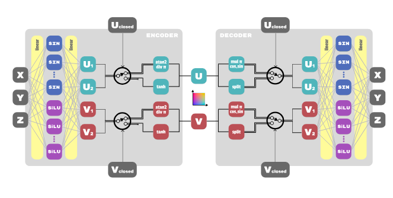
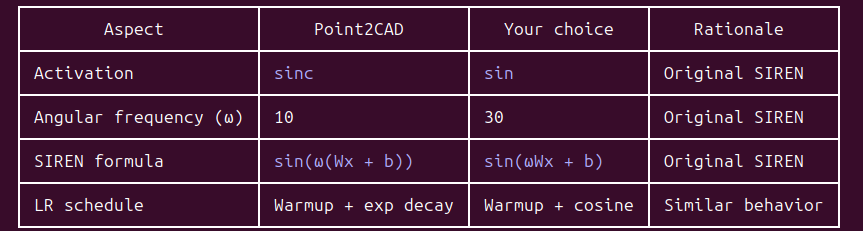

Triangle mesh:

$V = \{ v_i \in \mathbb{R}^{3}\}_{i=1}^{N}$, $E = \{ (i, j) \mid v_i, v_j \in V\}$, $F = \{(i, j, k) \mid v_i, v_j, v_k \in \mathbb{R}^3\}$. Mesh is defined as a set of vertices, edges and faces. A triangular face defines a planar surface patch:
$$
F(u, v) = (1 - u - v) v_i + u v_j + v v_k, u, v \geq 0, u + v \leq 1
$$

* What does open and closed surface fitting mean?
* How exactly does INR represent a surface over a given point cluster, when the latent space is 2D? "For extrapolation and latent space traversal, we encode all cluster points into the latent uv space and store the bounding box parameters along with the autoencoder. We reset the corresponding axis range for surfaces with closed dimensions to [−1, 1]. To sample the extended surface with the margin, we extend the bounding box by 10% in both dimensions and compute 3D surface points using the decoder."

## Point2CAD curve fitting
In Point2CAD, the first stage after being provided a clustering of a set of 3D points is primitive curve fitting. Firstly, they fit the following parametric models:

* Plane parametrized by $(n, d)$, $n$ is the normal vector of unit norm, and $d$ is the distance to the origin. Every point $u$ from the plane must satisfy $un^{T} = d$.

* Sphere, $(c, r)$ $c$ is the center of the sphere and $r$ is its radius.

* Cylinder, $(a, c, r)$ center $c$, unit length vector $a$ that describes the axis of the cylinder, and $r$ is the cylinder radius.

* Cone, $(v, a, \theta)$, $v$ denotes the apex point, $a$ is a unit-length vector that describes the axis of the cone, and $\theta \in (0, \frac{\pi}{2}) $ is half the angle of a cone - maximum angular deviation from vector $a$ to points on the surface of the cone. Any point $p$ from the cone surface must satisfy $\frac{\langle a, p - v \rangle}{||p - v||_2} = cos(\theta)$

Additionally, they fit an **INR** implicit neural representation surface to a given set of points. INR is an autoencoder neural network, the encoder maps 3D points into a 2D latent space, and the decoder takes these latent representations and maps them back to the original 3D space. Before we continue, let us define what an open/closed parametrization of a surface means. Consider cylindric coordinates: $(Rcos\theta, Rsin\theta, h)$. This is a 2D parametrization, $\theta \in [0, 2\pi]$ and $h \in [0, H]$. This parametrization is **closed** in $\theta$ - periodic, and **open** in $h$ - non-periodic. Our INR generates a latent parametrization of the surface, in the form of $(u, v)$ coordinates. However, we do not know in advance if the optimal surface should be open/closed in $uv$, so the authors fit all 4 possible combinations of openness/closedness in $uv$. The INR neural network accomodates for this: (https://github.com/prs-eth/point2cad/blob/main/point2cad/fitting_one_surface.py#L758, https://github.com/prs-eth/point2cad/blob/main/point2cad/fitting_one_surface.py#L772).



Regardless of openness/closedness, the latent space ends up being a unit square $[-1, 1]^{2}$. In the code, they also talk about **lifted latent space**, those are coordinates $(u_1, u_2, v_1, v_2)$, this is important for loss components not included in the paper, it's arguable if these components are even important - if they were important for SOTA results they would have surely added them to the paper. Regardless, the main component of the loss function is reconstruction error. There are 2 additional loss components not included in the original paper:

* **UV tightness** TODO
* **Metric learning** - We give pseudocode for computing this component:
```
cdist_3d = torch.cdist(x, x)  # Pairwise distances in 3D
cdist_uv = torch.cdist(uv_lifted, uv_lifted)  # Pairwise distances in UV

# Find K pairs that are FAR in 3D
far_pairs = topk(cdist_3d, K, largest=True)
# Find K pairs that are CLOSE in 3D  
close_pairs = topk(cdist_3d, K, largest=False)

# Ranking loss: close pairs should have smaller UV distance than far pairs
loss_metric = mean(relu(cdist_uv[close_pairs] - cdist_uv[far_pairs] + margin))
```

Basically this is a contrastive component, real points close to one another should have close UV representations, similar for dissimilar real points. Default value for the margin parameter seems to be $0.2$. The best INR is the one that achieves lowest reconstruction, and recall that there are 4 INRs being fitted to every point cluster.

So, after this procedure we obtain 5 different surfaces for a given cluster of points. For INR, the error is simply reconstruction error, for other 4 primitive surfaces, we project all real points to the interpolated surface, and we measure the distance between the given point and the projection. We take **the simplest surface with lowest error**. Now what does this mean precisely? If INR achieves the lowest error (and it usually will), we will check if the minimum error of remaining 4 surfaces is within a given error margin, if it is we take the simpler surface - otherwise we settle with INR (**slightly more logic behind the choosing procedure, but this is the main idea, elaborate futher**). (https://github.com/prs-eth/point2cad/blob/main/point2cad/fitting_one_surface.py#L96). 

Instead of using analytical representations for all surfaces, the authors instead use triangle mesh representations. Using analytical representations could potentially lead to very numerically unstable calculations. A triangle mesh is created by first sampling points from the given surface and then creating a triangle mesh from it. In particular, for INR, we take the $uv$ bounding box for the current cluster - determined by the minimum and maximum values in both coordinates, recall that the latent space is $[-1, 1]^{2}$. Next, we extend the bounding box by 10%, and from this extended bounding box we sample sufficient number of points, for which we create a triangle mesh.

During training of the INR, they optionally add noise to encoder/decoder inputs, in order to make the network more robust to small perturbations:
```
langevin_noise_schedule = (num_fit_steps - step - 1) / (num_fit_steps - 1)
x_input = x
if langevin_noise_magnitude_3d > 0:
    x_input = x + (
        langevin_noise_magnitude_3d * langevin_noise_schedule
    ) * torch.randn_like(x)
uv = model.encoder(x_input)
uv_input = uv
if langevin_noise_magnitude_uv > 0:
    uv_input = uv + (
        langevin_noise_magnitude_uv * langevin_noise_schedule
    ) * torch.randn_like(uv)
x_hat = model.decoder(uv_input)
```

SIREN layer:
$$
\Phi(x) = sin(\omega Wx + b), x \in \mathbb{R}^{n}, X \in \mathbb{R}^{m \times n}, b \in \mathbb{R}^{m}
$$

Starting from the second hidden layer of SIREN, authors argue that the initialization of weights should be $U(-\sqrt{\frac{6}{\text{n}}}, \sqrt{\frac{6}{n}})$, in order for the matrix product to be uniformly distributed across components. However, Point2CAD INR uses only a single hidden layer, even though this extended initialization is present in the original codebase, it is not relevant. They use $U(-\frac{1}{n}, \frac{1}{n})$, without clear justification. So, according to performed ablations, this is how hidden layer of the INR should look like:
```
# Each "hidden layer" in block_type="combined"
┌─────────────────────────────────────┐
│ SIREN path (50% channels):          │
│   Linear with custom init           │
│   → multiply by ω=10                │
│   → sinc(x)                         │
├─────────────────────────────────────┤
│ "ResBlock" path (50% channels):     │
│   Linear (standard init)            │
│   → BatchNorm                       │
│   → (NO skip connection by default) │
│   → SiLU(x)                         │
└─────────────────────────────────────┘
         ↓
    Concatenate
```

SIREN official implementation, first layer initialization:

https://github.com/vsitzmann/siren/blob/master/modules.py#L630

If a skip connection is turned on, then an additional learnable weight parameter is added - controls the strength of the skip connection, the weight affects the downstream path of the network. Dimensionality of the hidden layer is 64, with evenly distributed neurons among SIREN and SiLU blocks.

## Analytical formulas for surfaces
* Scalar projection of vector $a$ to vector $b$: 

$$||a|| \cos \theta = |||a|| \frac{a^{T}b}{||a|| ||b||} = \frac{a^{T}b}{||b||}.
$$

* Vector projection of vector $a$ to vector $b$: scalar projection multiplied by $b$ itself (normed to unit length): $$\frac{a^{T}b}{||b||} \frac{b}{||b||} = \frac{a^{T}b}{||b||^{2}}b = proj_b(a)$$

* Orthogonal projection of vector $a$ to vector $b$:
$$
a - \frac{a^{T}b}{||b||^{2}}b = orth_b(a) = a - proj_b(a)
$$

It's easy to verify that $orth_b(a)^{T}b = (a - \frac{a^T{b}}{||b||^{2}}b)^{T}b = a^{T}b - \frac{b^{T}b^{T}a}{||b||^{2}}b = a^{T}b - \frac{||b||^{2}a^{T}b}{||b||^2} = a^{T}b - a^{T}b = 0$

* **Hyperplane**: described by a set of points satisfying $a^{T}x = d$, where $a \in \mathbb{R}^{n}$ is the direction vector typically of unit length, and $d \in \mathbb{R}$. Only in the case of $d = 0$ can we construct a corresponding linear operator.

* Projecting a vector to a plane: if we do $orth_a(x)$ we will obtain a vector perpendicular to $a$, but we need to satisfy the hyperplane condition, so we add $ad$ to the orthogonal projection to satisfy the requirement $a^{T}x = d$. The final formula is:
$$
proj\_plane_{a, d}(x) = orth_a(x) + ad
$$

* Plane reconstruction error: $||proj\_plane_{a, d}(x) - x||_2^{2}$. For a set of ground truth points take the mean over this expression.

* Hypersphere: $\sum_{i=1}^{N}(x_i - a_i)^{2} = r$, where $r > 0$ is the radius parameter, and $a \in \mathbb{R}^{n}$ is the center point.

* Hypersphere error: $|||x - a|| - r|$. Essentially, we take the difference vector between the center and the given point, and measure it's deviation from the radius, ignoring direction.

* Cylinder. Characterized by $(a, c, r)$, center point $c$, unit length vector $a$ that defines the axis of the cylinder, and radius parameter $r > 0$. Point $x$ lies on the cylinder if and only if:
$$
(x - c)^{T}(I - aa^{T})(x - c) = r^2
$$

Some elaborations regarding the previous equation. For a plane centered at 0 ($d = 0$), $I - aa^{T}$ is the plane projection operator, easily verifiable. First subtract the center point from the input $x$, and then project it to the plane with normal vector $a$ centered at $c$, this is $(I - aa^{T})(x - c)$ part of the expression. Next we measure the norm of this orthogonal component, it must be equal to $r$. Using the symmetry and idempotency of plane projection operator, the squared norm of $(I - aa^{T})(x - c)$ turns out to be $(x - c)^{T}(I - aa^{T})(x - c)$. This must be equal to $r^2$ - recall the squaring part.

* Cylinder error: It's simply the absolute deviation of $(I - aa^{T})(x - c)$ from $r$. Note that we do not look at the squared norm, that is why the square in r is removed. Mean of this is taken over a set of points, if multiple points are present. For least-squares cylinder fitting we observe the square of the deviation, for simply measuring the fit error we take the absolute value.

* Cone can be parametrized by $(v, a, r)$, where $v$ is the apex point, $a$ is the unit vector that represents the axis of the cone, and $\theta \in (0, \frac{\pi}{2})$ represents the half-angle of a cone. Membership condition is the following:
$$
a^{T}(\frac{x - v}{||x - v||}) = \cos \theta
$$
or equivalenty, as a quadratic form:
$$
(x - v)^{T}(\cos^2 \theta I - aa^{T})(x - v) = 0
$$

Geometrical interpretation of this would be that point $x$ lies on the given cone if and only if the angle between the axis vector and the vector pointing from the apex to the given point is $\theta$. 

* Cone error. We want to measure how well our cone fits the data, disregarding the least-squares expression for cone fitting with LM or other algorithm. Let $x_i$ be the point for which we want to measure the error. We observe the vector $z_i = x_i - v$, it's scalar projection to the axis is $h_i = a^{T}z_i$, while the orthogonal projection is $r_i = z_i - h_ia$. We observe the right triangle with catheti $||r_i||$ and $|h_i|$, the hypothenuse being $||z_i||$. If $x_i$ is actually on the cone, then we would have:
$$
\tan \theta = \frac{||r_i||}{|h_i|} \Rightarrow |h_i| \sin \theta = ||r_i|| \cos \theta
$$

If a point does not belong to the cone, we simply measure the deviation between these two quantities:
$$
||h_i| \sin \theta  - ||r_i|| \cos \theta|
$$

and average over a set of points, if a set of points is given.

* In general, all surfaces in $R^{3}$ can be written as:
$$
x^{T}Qx + a^{T}x + b
$$

## Flaws/bugs in Point2CAD implementation. Differences from the original implementation, general notes...
* For SIREN layers, they use $sinc(x) = \frac{sin(\pi x)}{\pi x}$ activation, instead of ordinary sine. SIREN paper precisely derived modified initialization for linear layers, this initialization is not theoretically justified for $sinc$, yet they still use it in Point2CAD implementation. (https://github.com/prs-eth/point2cad/blob/main/point2cad/layers.py#L77)

* Further experiments with cone fitting, is current mathematical setup the best? The official implementation uses actual distances with double absolute values, and they use LM optimization algorithm that does not support giving bounds for the half-angle that should lie in $(0, \pi / 2)$. The TRF algorithm seemingly gave better results, and it does support bounds. Investigate mathematical details behind both algorithms, and further think about cone fitting intricacies!

* Default learning rate for INR is 1e-1, we will try with slightly lower learning rate 1e-2. Use as much GPU memory as possible, in our implementation resolved by `automatic_batch_size` function in inr.py. 

* Default noise magnitude for both 3D and UV seems to be 0.005: https://github.com/prs-eth/point2cad/blob/81e15bfa952aee62cf06cdf4b0897c552fe4fb3a/point2cad/fitting_one_surface.py#L313

* Our INR implementation vs actual INR implementation:


* Error threshold for simple surfaces, kept the same for current implementation. Instead of additive error threshold, look at ratio between INR error and simple error. Instead of absolute error threshold for fixing degenerate cones, look at ratio between plane error and cone error. Mention that unlike in the original implementation, we sidestep INR fitting unless it is absolutely necessary.

* Point2CAD parallelism: each cluster is fitted in parallel, but 4 INR are fitted sequentially on a single process. Perhaps paralellize this operation as well? Relevant code lines: https://github.com/prs-eth/point2cad/blob/81e15bfa952aee62cf06cdf4b0897c552fe4fb3a/point2cad/main.py#L14, https://github.com/prs-eth/point2cad/blob/main/point2cad/fitting_one_surface.py#L17

* Paper sent by the professor does not containt Point2CAD as a reference, which is a bit concerning. I found one paper way back that goes from meshes to NURBS - https://ieeexplore.ieee.org/document/10824954/

* Cylinder fitting with numpy vector operations gives the same results as the original cylinder fitting algorithm, while being up to 180 times faster! For instance, for abc_00470.xyzc, for the cluster of ~7.9k points, native algorithm took 9.5 seconds, while the optimizer numpy version took 0.05 seconds. 

* Default number of points for creating INR mesh seems to be 10000. (https://github.com/prs-eth/point2cad/blob/81e15bfa952aee62cf06cdf4b0897c552fe4fb3a/point2cad/fitting_one_surface.py#L355). That is mesh_dim ** 2.

* INR mesh generation does not include trimming, which is not the case for primitive types? Intentional inconsistency, or a bug?

* We implemented UV grid generation for every surface type such that the first coordinate moves slow, and the second coordinate moves fast. This is not consistent across the original Point2CAD codebase.

* MAE seems to produce visually better results compared to MSE, although we did not quantify this precisely, just an observation from a couple of examples.

* For pymesh compatibility, we had to downgrade numpy to 1.26.4 from 2.4.2. Interestingly, when running cylinder fitting benchmark, the 2.4.2 algorithm seems to be faster than the 1.26.4 - speedup rate for 1.26. is at most 95x original, while the speedup rate for 2.4.2 is at most x180.

```
Results for 1.26.4, point cloud 00470:
Processing cluster with id 0.
Number of points in the current cluster: 1028
Cylinder fitting time with native code: 1.312288522720337 seconds.
Native cylinder error: 6.1924631501943335
Cylinder fitting time with optimized code: 0.015154600143432617 seconds.
Optimized cylinder error: 6.192463160219301
L2 difference between axis vectors: 2.8749021979984843e-09
L2 difference between center points: 1.0760264825014586e-09
Difference in fitted radii: 3.6776270917471265e-08
Speedup factor: 86.59341126126834
Cylinder convergence status: True

Processing cluster with id 1.
Number of points in the current cluster: 1028
Cylinder fitting time with native code: 1.37461519241333 seconds.
Native cylinder error: 6.278240067479877
Cylinder fitting time with optimized code: 0.014910221099853516 seconds.
Optimized cylinder error: 6.27824007727802
L2 difference between axis vectors: 2.7150469907790152e-09
L2 difference between center points: 1.7108744413858427e-09
Difference in fitted radii: 3.493474665106078e-08
Speedup factor: 92.1928107710512
Cylinder convergence status: True

Processing cluster with id 2.
Number of points in the current cluster: 7944
Cylinder fitting time with native code: 8.848136186599731 seconds.
Native cylinder error: 8.766859389410952
Cylinder fitting time with optimized code: 0.09309148788452148 seconds.
Optimized cylinder error: 8.766859385768539
L2 difference between axis vectors: 3.005802308669373e-09
L2 difference between center points: 7.706171920834368e-08
Difference in fitted radii: 9.678309709215682e-09
Speedup factor: 95.04774698171872
Cylinder convergence status: True
-------------------------------------------------

Results for 2.4.2, same point cloud 
Processing cluster with id 0.
Number of points in the current cluster: 1028
Cylinder fitting time with native code: 1.3476369380950928 seconds.
Native cylinder error: 6.192463151128931
Cylinder fitting time with optimized code: 0.014451265335083008 seconds.
Optimized cylinder error: 6.192463153605287
L2 difference between axis vectors: 5.531611314312923e-09
L2 difference between center points: 5.424249790173678e-09
Difference in fitted radii: 1.3034938461942147e-08
Speedup factor: 93.25390592777127
Cylinder convergence status: True

Processing cluster with id 1.
Number of points in the current cluster: 1028
Cylinder fitting time with native code: 1.4048054218292236 seconds.
Native cylinder error: 6.278240083319068
Cylinder fitting time with optimized code: 0.013335227966308594 seconds.
Optimized cylinder error: 6.278240073891429
L2 difference between axis vectors: 2.384984506082963e-09
L2 difference between center points: 1.10363456165582e-09
Difference in fitted radii: 3.4862900122334395e-08
Speedup factor: 105.34543731674175
Cylinder convergence status: True

Processing cluster with id 2.
Number of points in the current cluster: 7944
Cylinder fitting time with native code: 9.239214897155762 seconds.
Native cylinder error: 8.766859379767004
Cylinder fitting time with optimized code: 0.05113625526428223 seconds.
Optimized cylinder error: 8.7668593897137
L2 difference between axis vectors: 1.3302909079742042e-08
L2 difference between center points: 2.8461569417601113e-07
Difference in fitted radii: 3.8652856915177836e-08
Speedup factor: 180.67836311841143
Cylinder convergence status: True
```

* Mention that cylindere benchmark is not comprehensive, in the sense that it does not measure execution time for various point clouds. However, we hypothesize that the speedup will increase as the number of cylinder fitness function evaluations increases - that is where vectorized numpy operations are introduced. If the input point cloud deviates from the cylinder significantlly, more convergence steps will be necessary, thereby requiring more function evaluations with (un)optimized operations.

* Another critical hyperparameter seems to be the number of steps for training the INR. For the two sample point clouds, we found that training the INR for 1500 steps (as opposed to 1000 setps) produced better results. Try increasing this to 2000 perhaps?

## About misleading paper name
* On the paper title — yes, it's arguably misleading. "Point2CAD" implies you get a CAD model (a B-Rep solid you can import into SolidWorks/Fusion 360, edit parametrically, export to  STEP). What you actually get is a topology graph — intersection curves and corner points between surface patches. That's a necessary intermediate step toward B-Rep construction, but  it's not a CAD model. You can't manufacture from it, you can't do boolean operations on it, you can't edit features. The gap between "topology of trimmed surface patches" and "actual CAD solid" is substantial — it requires constructing trimmed NURBS patches, stitching them into a watertight shell, and encoding it in a B-Rep kernel like OpenCascade.

## Mesh operations
* How to represent a continuous parametrized surface with a mesh? There are several steps:
    * Sample a finite number of points from the surface. There are different sampling algorithms for different surface types, we will not be going over them in this section. For INR sampling, we sample in the UV space from the bounding box extended by a given margin on both sides of the box, and then pass those points through the decoder.

    * The sampled set of points needs to be triangulated. For all sampling algorithms, we typically create a 2D grid-like manifold which is then projected to the given surfae such that grid-like structure is preserved - allowing us to trivially compute the triangulation of the given point set, as illustrated on the figure below. There are 2 approaches: one proposed in the Point2CAD paper, and the other used by this implementation. It is worth noting that Point2CAD paper did not explicitly state the trimming algorithm, it was inferred from the codebase to work as follows:

    * First upsample the INPUT set of points - not points sampled on the surface but the actual ground truth points. The full algorithm can be found in (https://github.com/prs-eth/point2cad/blob/81e15bfa952aee62cf06cdf4b0897c552fe4fb3a/point2cad/fitting_utils.py#L66), but essentially it divides the input cluster into batches, for each batch and each point in the batch 5 closest points are computed (the implementation actually includes a bug because if we are considering points closest to $x$, $x$ itself will always be included, from the way they compute pairwise distances). After computing this for every point in the cluster (batching is just a memory optimization technique), means of 5 closest points for all points are computed and added to the original cluster, thereby adding $N$ new points. This process can be repeated arbitrarily, in each iteration doubling the size of the input cluster. After that they iterate over the cells of the UV grid, for each 2x2 block they compute the average point, and measure if the distance from the average point to the closest point of the newly upsampled cluster is within the given margin, if it is the corresponding neighboring points are included in the triangulation, otherwise they are masked out and ignored during triangulation.

    * Our algorithms differs slightly, we do not perform any upsampling, but our masking rule is different. Instead of looking for the closest point in the cluster, we look at topk distances (k = 5, but configurable). We argue that this has the same effect as upsampling the input cluster if the input cluster is sparsem we simply extend our search radius. From here, the triangulation procedure is the same.

```
    Meshing scheme:
    (i,j) -------- (i,j+1)                                                                                                                                                                
    |  \            |                                                                                                                                                                   
    |    \    T2    |                                                                                                                                                                   
    |  T1  \        |                                                                                                                                                                   
    |        \      |                                                                                                                                                                   
    (i+1,j) ---- (i+1,j+1)
```

* Before performing the actual triangulation however, we must trim the sampled grid to match the input cluster - we do not want large deviations from the ground trugh points.  

* From the perspective of the UV space, it is guaranteed that all triangles formed like this are regular. However, after decoding to 3D we do not have this guarantee. Perhaps additional post-processing operations should be performed after constructing a mesh.

* Actually, we ended up using a different distance metric for UV grid trimming alltogether. First, for each point in the cluster, we compute it's closest point (excluding itself of course), and keep the measured distance. Then we compute a median over these distances. Now, a grid cell $u, v$ is kept iff:
```
min([distance(mean(u, v) - x) for x in cluster]) < median * threshold_multiplier
```

We set the threshold to 2 for now.

## Surface sampling algorithms
* INR - Forward the input cluster thorugh the encoder to obtain UV space bounding box coordinates. From here, for each axis of the bounding box extend it by the given margin (the paper says 10%, but the actual implementation uses 20%, https://github.com/prs-eth/point2cad/blob/81e15bfa952aee62cf06cdf4b0897c552fe4fb3a/point2cad/fitting_one_surface.py#L355). Construct a grid in the UV space - we use `torch.meshgrid` in combination with `torch.linspace` and forward those points through the decoder to obtain INR samples. One last note, the paper assumes that a well trained INR decoder will preserve the grid like pattern in the 3D space allowing for easier triangulation, however there are no theoretical guarantees for this... Perhaps doing Delaunay triangulation manually would be best solution? However, Delaunay triangulation in 3D produces tetrahedras (simplex in 3D). Additionally, Point2CAD implementation of INR to mesh does not include the trimming step on the UV grid, add this in the reproduction?

* Plane - Sample $r_1, r_2$ from $U(0, 1)$, plug them to the plane equation and compute the missing coordinate $x$ as $x = \frac{d - a[1]r_1 - a[2]r_2}{a[0] + \epsilon}$, The point $(x, r_1, r_2)$ belongs to the plane, or at least approximately. Convert this to a plane vector by subtracting $ad$ from it. To obtain $(x, y)$ orthonormal basis that generates the plane simply compute $y = x \times a$. Now $(x, y)$ is the orthonormal basis that spans the plane, compute a grid over $[-scale, scale]^2$ and pass it through the $xy$ span, while also adding the mean of the original cluster projected to the plane parametrized by $(a, d)$.

* Sphere - 
* Cylinder - 
* Cone - 

## Misc
* Outer product quadratic form partial derivative wrt. outer product vector (derived by hand):
$$
\frac{\partial}{\partial w} y^{T}(ww^{T})y = 2(y^{T}w)y
$$

* Derivative of unit length normalization (derived by hand):
$$
\frac{\partial}{\partial w} (\frac{w}{||w||}) = \frac{1}{||w||}(I - \hat{w} \hat{w}^{T}), \hat{w} = \frac{w}{||w||}
$$

* General chain rule for vector differentiation (write it out correctly!):
$$
f : \mathbb{R}^{n} \rightarrow \mathbb{R}^{m}, g : \mathbb{R}^{m} \rightarrow \mathbb{R}^{k}, h(x) = g(f(x)), \text{ then}:

\frac{\partial h}{\partial x} = 
$$

* Parameters of the INR network used by Point2CAD: hidden_dim = 64, fraction_siren = 0.5, use_shortcut = False. 4 networks are trained in parallel using ADAM for 1000 steps, with 50 warmup steps.

* Native cylinder fitting and our cylinder fitting can differ only in the direction of the axis vector, only as sever as $a = -a$, but this is not important. That is why in some logs for error measurements, we see that $||a - a'|| = ||2a|| = 2 ||a|| = 2$, the L2 error between fitted axis vectrors is 2.

* A useful blog that explains how sphere fitting can be linearized. This implementation uses the same algorithm, write it down mathematically in the master thesis report.
https://jekel.me/2015/Least-Squares-Sphere-Fit/

* Open3D + PyVista:
Open3D + PyVista (no Trimesh)                                                                                                            
Yes, this works. Your pipeline:                                                                                                          
```                                      
  1. Construct mesh with Open3D                                                                                                                                                       
  o3d_mesh = sample_inr_mesh_o3d(...)                                                                                                                                                   
                                                                                                                                                                                        
  2. Convert to PyVista for intersection operations                                                                                                                                   
  o3d.io.write_triangle_mesh("/tmp/mesh.ply", o3d_mesh)                                                                                                                                 
  pv_mesh = pv.read("/tmp/mesh.ply")                                                                                                                                                    
                                                                                                                                                                                        
  # Or directly (without temp file):                                                                                                                                                    
  pv_mesh = pv.wrap(o3d_mesh)  # May need: pv.utilities.helpers.wrap                                                                                                                    
                                                                                                                                                                                        
  Actually, the cleanest conversion:                                                                                                                                                    
                                                                                                                                                                                        
  import pyvista as pv                                                                                                                                                                  
  import numpy as np                                                                                                                                                                    

  vertices = np.asarray(o3d_mesh.vertices)
  faces = np.asarray(o3d_mesh.triangles)

  # PyVista expects faces as [n_verts, v0, v1, v2, n_verts, v0, v1, v2, ...]
  pv_faces = np.hstack([[3] + list(f) for f in faces])
  pv_mesh = pv.PolyData(vertices, pv_faces)
```

```
N - number of consecutive points taken
M - total points
x <- (N, 1, 3)
y <- (1, M, 3)

Broadcasting: (N, M, 3)

z <- ((x - y) ** 2).sum(dim = -1) => (N, M)
_, indices <- z.topk(5, largest = False) Pairs of points closest to each other.
```

* o3d.utility.Vector3dVector - Can represent ordinary 3d vectors/points
* o3d.utility.Vector3iVector - Collection of 2D vectors (int32), representing linked points. Useful for representing triangles.
* o3d.utlity.Vector2iVector - Collection of 3D vectors (int32), representing linked points. Useful for representing lines.

* Downloading ABC dataset chunks handle: https://archive.nyu.edu/handle/2451/43778. Supposedly, we require META/FEAT and OBJ files to generate segmented point clouds from here.

* Point2Primitive dataset construction notes: https://github.com/AnonymousRepo1234/Point2Primitive